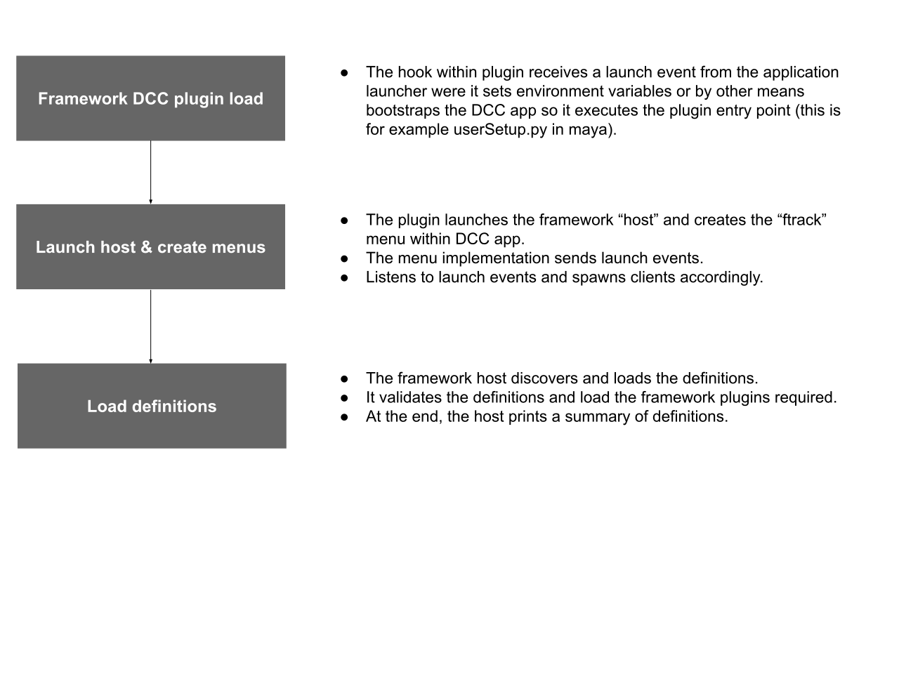

..
    :copyright: Copyright (c) 2022 ftrack

.. _introduction/how/launch:

**********
DCC launch
**********

The following flowchart describes the DCC bootstrap process and how it interacts with
the Framework:

Standalone
##########

In standalone mode, outside the DCC application, the launch is identical. Instead
of targeting the DCC host when it comes to loading definitions, the "python" host
type is instead used.

